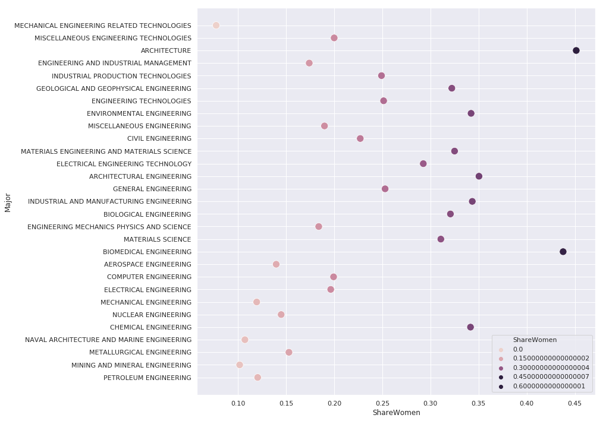

```
import pandas as pd
import numpy as np
import seaborn as sns
```

We can read the data directly from github. See additional details about the dataset [here](https://github.com/fivethirtyeight/data/tree/master/college-majors).


```
majors = pd.read_csv("https://raw.githubusercontent.com/fivethirtyeight/data/master/college-majors/recent-grads.csv")
women_stem = pd.read_csv("https://raw.githubusercontent.com/fivethirtyeight/data/master/college-majors/women-stem.csv")
```


```
majors.head(5)
```


<div>
<style scoped>
    .dataframe tbody tr th:only-of-type {
        vertical-align: middle;
    }

    .dataframe tbody tr th {
        vertical-align: top;
    }

    .dataframe thead th {
        text-align: right;
    }
</style>
<table border="1" class="dataframe">
  <thead>
    <tr style="text-align: right;">
      <th></th>
      <th>Rank</th>
      <th>Major_code</th>
      <th>Major</th>
      <th>Total</th>
      <th>Men</th>
      <th>Women</th>
      <th>Major_category</th>
      <th>ShareWomen</th>
      <th>Sample_size</th>
      <th>Employed</th>
      <th>Full_time</th>
      <th>Part_time</th>
      <th>Full_time_year_round</th>
      <th>Unemployed</th>
      <th>Unemployment_rate</th>
      <th>Median</th>
      <th>P25th</th>
      <th>P75th</th>
      <th>College_jobs</th>
      <th>Non_college_jobs</th>
      <th>Low_wage_jobs</th>
    </tr>
  </thead>
  <tbody>
    <tr>
      <th>0</th>
      <td>1</td>
      <td>2419</td>
      <td>PETROLEUM ENGINEERING</td>
      <td>2339.0</td>
      <td>2057.0</td>
      <td>282.0</td>
      <td>Engineering</td>
      <td>0.120564</td>
      <td>36</td>
      <td>1976</td>
      <td>1849</td>
      <td>270</td>
      <td>1207</td>
      <td>37</td>
      <td>0.018381</td>
      <td>110000</td>
      <td>95000</td>
      <td>125000</td>
      <td>1534</td>
      <td>364</td>
      <td>193</td>
    </tr>
    <tr>
      <th>1</th>
      <td>2</td>
      <td>2416</td>
      <td>MINING AND MINERAL ENGINEERING</td>
      <td>756.0</td>
      <td>679.0</td>
      <td>77.0</td>
      <td>Engineering</td>
      <td>0.101852</td>
      <td>7</td>
      <td>640</td>
      <td>556</td>
      <td>170</td>
      <td>388</td>
      <td>85</td>
      <td>0.117241</td>
      <td>75000</td>
      <td>55000</td>
      <td>90000</td>
      <td>350</td>
      <td>257</td>
      <td>50</td>
    </tr>
    <tr>
      <th>2</th>
      <td>3</td>
      <td>2415</td>
      <td>METALLURGICAL ENGINEERING</td>
      <td>856.0</td>
      <td>725.0</td>
      <td>131.0</td>
      <td>Engineering</td>
      <td>0.153037</td>
      <td>3</td>
      <td>648</td>
      <td>558</td>
      <td>133</td>
      <td>340</td>
      <td>16</td>
      <td>0.024096</td>
      <td>73000</td>
      <td>50000</td>
      <td>105000</td>
      <td>456</td>
      <td>176</td>
      <td>0</td>
    </tr>
    <tr>
      <th>3</th>
      <td>4</td>
      <td>2417</td>
      <td>NAVAL ARCHITECTURE AND MARINE ENGINEERING</td>
      <td>1258.0</td>
      <td>1123.0</td>
      <td>135.0</td>
      <td>Engineering</td>
      <td>0.107313</td>
      <td>16</td>
      <td>758</td>
      <td>1069</td>
      <td>150</td>
      <td>692</td>
      <td>40</td>
      <td>0.050125</td>
      <td>70000</td>
      <td>43000</td>
      <td>80000</td>
      <td>529</td>
      <td>102</td>
      <td>0</td>
    </tr>
    <tr>
      <th>4</th>
      <td>5</td>
      <td>2405</td>
      <td>CHEMICAL ENGINEERING</td>
      <td>32260.0</td>
      <td>21239.0</td>
      <td>11021.0</td>
      <td>Engineering</td>
      <td>0.341631</td>
      <td>289</td>
      <td>25694</td>
      <td>23170</td>
      <td>5180</td>
      <td>16697</td>
      <td>1672</td>
      <td>0.061098</td>
      <td>65000</td>
      <td>50000</td>
      <td>75000</td>
      <td>18314</td>
      <td>4440</td>
      <td>972</td>
    </tr>
  </tbody>
</table>
</div>


```
women_stem.head(5)
```

Focus: Engineering and  Technology 
- Major 
- major_category 
- total 
- sample_size
- men 
- women 
- share_women (proportion of percentage of women in that major)
- full_time 
- part_time 
- unemployed 
- median 
- college_jobs 
- non_college_jobs 
- low_wage_jobs 


```
#Limit rows to majors we want 
subset_engineering = majors[majors["Major_category"] == "Engineering"]
subset_engineering.head()
```


<div>
<style scoped>
    .dataframe tbody tr th:only-of-type {
        vertical-align: middle;
    }

    .dataframe tbody tr th {
        vertical-align: top;
    }

    .dataframe thead th {
        text-align: right;
    }
</style>
<table border="1" class="dataframe">
  <thead>
    <tr style="text-align: right;">
      <th></th>
      <th>Rank</th>
      <th>Major_code</th>
      <th>Major</th>
      <th>Total</th>
      <th>Men</th>
      <th>Women</th>
      <th>Major_category</th>
      <th>ShareWomen</th>
      <th>Sample_size</th>
      <th>Employed</th>
      <th>Full_time</th>
      <th>Part_time</th>
      <th>Full_time_year_round</th>
      <th>Unemployed</th>
      <th>Unemployment_rate</th>
      <th>Median</th>
      <th>P25th</th>
      <th>P75th</th>
      <th>College_jobs</th>
      <th>Non_college_jobs</th>
      <th>Low_wage_jobs</th>
    </tr>
  </thead>
  <tbody>
    <tr>
      <th>0</th>
      <td>1</td>
      <td>2419</td>
      <td>PETROLEUM ENGINEERING</td>
      <td>2339.0</td>
      <td>2057.0</td>
      <td>282.0</td>
      <td>Engineering</td>
      <td>0.120564</td>
      <td>36</td>
      <td>1976</td>
      <td>1849</td>
      <td>270</td>
      <td>1207</td>
      <td>37</td>
      <td>0.018381</td>
      <td>110000</td>
      <td>95000</td>
      <td>125000</td>
      <td>1534</td>
      <td>364</td>
      <td>193</td>
    </tr>
    <tr>
      <th>1</th>
      <td>2</td>
      <td>2416</td>
      <td>MINING AND MINERAL ENGINEERING</td>
      <td>756.0</td>
      <td>679.0</td>
      <td>77.0</td>
      <td>Engineering</td>
      <td>0.101852</td>
      <td>7</td>
      <td>640</td>
      <td>556</td>
      <td>170</td>
      <td>388</td>
      <td>85</td>
      <td>0.117241</td>
      <td>75000</td>
      <td>55000</td>
      <td>90000</td>
      <td>350</td>
      <td>257</td>
      <td>50</td>
    </tr>
    <tr>
      <th>2</th>
      <td>3</td>
      <td>2415</td>
      <td>METALLURGICAL ENGINEERING</td>
      <td>856.0</td>
      <td>725.0</td>
      <td>131.0</td>
      <td>Engineering</td>
      <td>0.153037</td>
      <td>3</td>
      <td>648</td>
      <td>558</td>
      <td>133</td>
      <td>340</td>
      <td>16</td>
      <td>0.024096</td>
      <td>73000</td>
      <td>50000</td>
      <td>105000</td>
      <td>456</td>
      <td>176</td>
      <td>0</td>
    </tr>
    <tr>
      <th>3</th>
      <td>4</td>
      <td>2417</td>
      <td>NAVAL ARCHITECTURE AND MARINE ENGINEERING</td>
      <td>1258.0</td>
      <td>1123.0</td>
      <td>135.0</td>
      <td>Engineering</td>
      <td>0.107313</td>
      <td>16</td>
      <td>758</td>
      <td>1069</td>
      <td>150</td>
      <td>692</td>
      <td>40</td>
      <td>0.050125</td>
      <td>70000</td>
      <td>43000</td>
      <td>80000</td>
      <td>529</td>
      <td>102</td>
      <td>0</td>
    </tr>
    <tr>
      <th>4</th>
      <td>5</td>
      <td>2405</td>
      <td>CHEMICAL ENGINEERING</td>
      <td>32260.0</td>
      <td>21239.0</td>
      <td>11021.0</td>
      <td>Engineering</td>
      <td>0.341631</td>
      <td>289</td>
      <td>25694</td>
      <td>23170</td>
      <td>5180</td>
      <td>16697</td>
      <td>1672</td>
      <td>0.061098</td>
      <td>65000</td>
      <td>50000</td>
      <td>75000</td>
      <td>18314</td>
      <td>4440</td>
      <td>972</td>
    </tr>
  </tbody>
</table>
</div>


```
sns.set(rc={'figure.figsize':(12,12)}) 
sns.scatterplot(x = "ShareWomen", y = "Major", hue = "ShareWomen", data= subset_engineering, s=150)
```


    <matplotlib.axes._subplots.AxesSubplot at 0x7fd82fb4ff28>





This plot is showing the share of women in a subset of Engineering careers. From the plot we can see a near percentage of the number of women in a specific occupation of engineering. 
